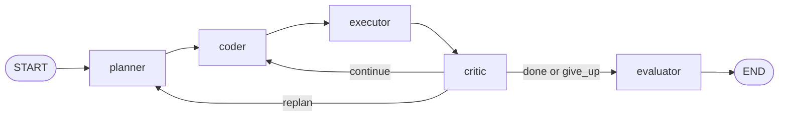

# Automaton

Automaton is a small LangGraph coding-agent prototype. It plans a fix, edits one
file, runs tests, critiques the result, optionally replans, and records benchmark
metrics plus LangSmith traces.

## Architecture



The planner reads the task directory and produces a structured plan. The coder
returns one full-file edit, the executor runs pytest inside the locked working
directory, and the critic decides whether to continue, replan, finish, or give
up. The evaluator records the final status and trajectory metadata.

## Setup

Create and activate a virtual environment, then install the project:

```bash
python -m venv venv
source venv/bin/activate
python -m pip install -e .
```

Create `.env` from the example file:

```bash
cp .env.example .env
```

Then fill in `GEMINI_API_KEY`. LangSmith settings are optional, but the defaults
in `.env.example` are ready for trace capture once `LANGSMITH_API_KEY` is set.

## Run

Run the default graph entry point:

```bash
python agent.py
```

Run one benchmark task on a temporary copy:

```bash
python run_task.py benchmarks/tasks/task_001
```

Run the full benchmark suite:

```bash
python eval_harness.py
```

Run the local Streamlit UI:

```bash
streamlit run demo/app.py
```

Run a local smoke check without calling Gemini:

```bash
python -m py_compile state.py nodes.py agent.py eval_harness.py run_task.py demo/app.py
```

## Outputs

`eval_harness.py` writes:

- `benchmark_results.json`: compact latest metrics
- `trajectory_report.json`: latest detailed trajectories, critiques, eval results
- `benchmark_runs/latest_results.json`: latest compact metrics
- `benchmark_runs/latest_trajectory.json`: latest detailed report
- `benchmark_runs/history/*`: timestamped local benchmark history

Generated reports are ignored by git.

## LangSmith

With the `.env` values above, LangChain/LangGraph automatically sends traces to
the `Automaton` LangSmith project. Each benchmark task is invoked with a named
top-level run, tags, and task metadata:

- Run name: `automaton:{task_id}`
- Tags: `automaton`, `benchmark`, run source, category, difficulty
- Metadata: task id, category, difficulty, source directory, working directory,
  max iterations, run source

Expected trace shape:

```text
automaton:task_001
  planner
    planner:model
  coder
    coder:model
    write_file
  executor
    run_command
  critic
    critic:model, when tests are still failing
  evaluator
```

LangSmith should show graph nodes plus nested file tools, Gemini model calls,
pytest execution, inputs, outputs, and latency. The local
`trajectory_report.json` remains the canonical benchmark report for final
success, test integrity, changed tests, and per-run summaries.

## Benchmarks

Benchmark tasks live in `benchmarks/tasks/task_*`. Each task has:

- `task.json`: prompt, category, difficulty
- implementation files with intentional bugs
- `test_*.py` files that define expected behavior

The harness copies each task to a temp directory before running the agent. A run
is marked unsuccessful if the agent changes any `test_*.py` file.

## Example Trajectory

This is the normal shape of a successful run:

```text
input
  Fix the bug described by benchmarks/tasks/task_001/task.json.

planner
  Read the task files and identify the implementation file under test.

coder
  Rewrite the target implementation file with the minimal fix.

executor
  Run pytest --tb=short in the temporary task copy.

critic
  Confirm tests passed and return verdict=done.

evaluator
  Mark success=true, final_status=passed, and record iterations_used.
```

## Project Structure

```text
agent.py                LangGraph wiring and routing
nodes.py                planner, coder, executor, critic, evaluator
state.py                shared state and structured models
tools.py                file and command tools
eval_harness.py         full benchmark runner
run_task.py             single-task runner
demo/app.py             local Streamlit UI
benchmarks/tasks/       benchmark fixtures
```
